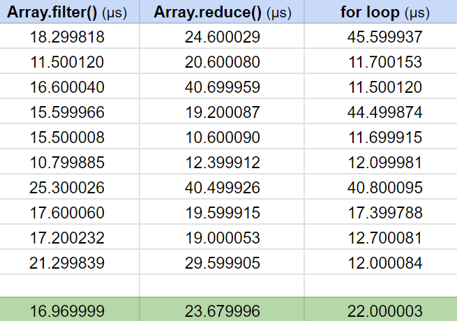

# Coding test consecutive duplicates

## Context and Problem Statement

I have written a function that accepts a `Record<string, any[]>` as input and returns a new `Record` with the same keys, but with consecutive duplicates removed from their respective values. I implemented the algorithm in three different ways to determine the most efficient approach in terms of performance and timing. Additionally, I have included several Jest tests to evaluate the functionality and performance of each approach.

## Decision Drivers

- **Performance Requirements**: If the application has strict performance requirements, the performance of each technique would be a significant driver. Considerations include the size of the input data and the frequency of the operation.
- **Code Readability and Maintainability**: The readability and maintainability of the code are essential factors, especially in collaborative projects or projects with long-term maintenance requirements.

## Considered Options

- **Array.filter() method**: The `Array.filter()` method is arguably the most important and widely used method for iterating over an array in JavaScript. The filter method creates a new array and returns all of the items which pass the condition specified in the callback.

- **Array.reduce() method**: The `Array.reduce()` method got its name from the functionality it provides, which is to iterate and “reduce” an array's values into one value.

- **simple for loop method**: A `for` loop is a statement that repeats the execution of a block of code when the condition has not been met and terminates the execution when the condition has been met.

## Decision Outcome

To determine the most efficient algorithm in terms of performance, I conducted a series of tests for each of the three solutions. I performed 10 iterations for each solution, with 20 attempts per iteration. The table below presents the average performance results for each algorithm.



In the last row of the table, I have displayed the average of all attempts, which shows that the algorithm implemented using the `Array.filter()` method has the best overall performance and stability. Additionally, the `Array.filter()` method and the `for` loop are more understandable for JavaScript programmers at any level, while the `Array.reduce()` method is less intuitive and [may not be as readable for some developers](https://betterprogramming.pub/think-again-before-you-use-array-reduce-28f785b5aea9). Considering these reasons, the conclusion is that the `Array.filter()` method is the best option in terms of both performance and readability.

## More information

### How to run the code and tests

Make sure that you have tsc (TypeScript compiler) and Node.js installed. Follow these steps to run the code and tests:

#### Running the code

1. Compile the TypeScript file:
   ```bash
   tsc code.ts
   ```
2. Run the compiled JavaScript file:
   ```bash
   node code.js
   ```

#### Running the tests

1. Install the required npm packages:
   ```bash
   npm install
   ```
2. Run the tests:
   ```bash
   npm test
   ```
